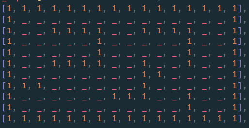
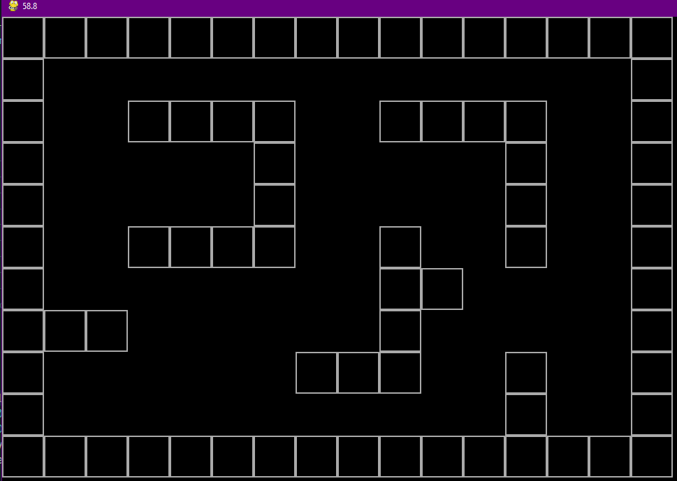

# Doom style game in python

project develop using pygame library

### Process
1. Game setup, define settings, map creation
2. Player Creation, movement and collisions


## Process

### 1. Game Setup:

- Define setting.py file with resolution, fps, tile_size and player characteristics
  
```
# game settings
RES  = WIDTH, HEIGHT = 1280, 720
FPS  = 60
TILE = 60

# PLAYER
PLAYER_POS       = 1.5, 5 # mini_map
PLAYER_ANGLE     = 0
PLAYER_SPEED     = 0.004
PLAYER_ROT_SPEED = 0.002
```

- create main.py file and initialize pygame with a Game class

```
class Game:
    def __init__(self): #constructor which initialize pygame modules
        pg.init()
        self.screen = pg.display.set_mode(RES) # create the screen for rendering the set resolution
        self.clock  = pg.time.Clock()          # instance of the clock class for framerate
        self.new_game()

    def new_game(self):                        # here we will create the map and the player
        pass

    def update(self):                          # here we will update every entity in the game
        pg.display.flip()
        self.clock.tick(FPS)                   # sets the frame of rate
        pg.display.set_caption(f'{self.clock.get_fps() :.1f}')

    def draw(self):                            # here we will draw the map and every entity
        self.screen.fill('black')

    def check_events(self):                    # checks to terminate the program
        for event in pg.event.get():
            if event.type == pg.QUIT or (event.type == pg.KEYDOWN and event.key == pg.K_ESCAPE):
                pg.quit()
                sys.exit()

    def run(self):                             # main loop of the game
        while True:                            # it consist of checking events, updating and drawing the entities
            self.check_events()
            self.update()
            self.draw()

if __name__ == '__main__':
    game = Game()  # create an instance of the game and run it
    game.run()
```
- to create the map we need an array to indicate where are the walls and draw it in the surface

```
_ = False
mini_map = [                                    # two dimensional array where 1 means wall and 0 is empty space
    [1, 1, 1, 1, 1, 1, 1, 1, 1, 1, 1, 1, 1, 1, 1, 1],
    [1, _, _, _, _, _, _, _, _, _, _, _, _, _, _, 1],
    [1, _, _, 1, 1, 1, 1, _, _, 1, 1, 1, 1, _, _, 1],
    [1, _, _, _, _, _, 1, _, _, _, _, _, 1, _, _, 1],
    [1, _, _, _, _, _, 1, _, _, _, _, _, 1, _, _, 1],
    [1, _, _, 1, 1, 1, 1, _, _, 1, _, _, 1, _, _, 1],
    [1, _, _, _, _, _, _, _, _, 1, 1, _, _, _, _, 1],
    [1, 1, 1, _, _, _, _, _, _, 1, _, _, _, _, _, 1],
    [1, _, _, _, _, _, _, 1, 1, 1, _, _, 1, _, _, 1],
    [1, _, _, _, _, _, _, _, _, _, _, _, 1, _, _, 1],
    [1, 1, 1, 1, 1, 1, 1, 1, 1, 1, 1, 1, 1, 1, 1, 1],
]

```
Then we make a Class for iterating and drawing the array

```
class Map:
    def __init__(self, game):                   # gets an instance of the game class as an input for the constructor
        self.game = game
        self.mini_map  = mini_map
        self.world_map = {}
        self.get_map()

    def get_map(self):
        for j, row in enumerate(self.mini_map): # iterate over the array and obtain the rows
            for i, value in enumerate(row):     # iterate over the rows and obtain the columns
                if value:                       # we get a (i,j) coordinates where there are walls in the map
                    self.world_map[(i,j)] = value

    def draw(self, tile):                       # displays the map in the screen
        # iterating each element in the world map it will draw an square
        [pg.draw.rect(self.game.screen, 'darkgray', (pos[0] * tile, pos[1] * tile, tile, tile), 2)
        for pos in self.world_map]

```
that give us the map drawn

 


### 2. Player Creation

we can add the player now, for that we generate a player.py file and build a Player class to give him attributes and methods

- Here, the interesting part is the movement and rotation of the player, which needs to be calculated with his coordinates `(x,y)`, for that we use trigonometry and find the delta(change) of each coordinate `(dx,dy)` with a basic formula of:
  ```
  dx = hypotenuse * cos(player_angle)
  dy = hypotenuse * sin(player_angle)
  ```
- in this case _hypotenuse_ is the player **speed**, and the player angle is the **direction** where the player is looking

